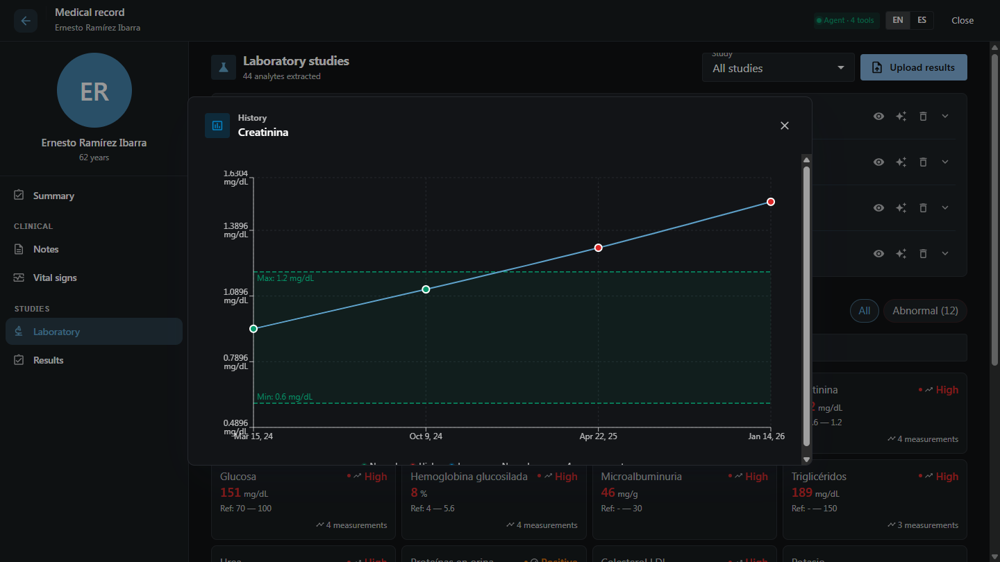
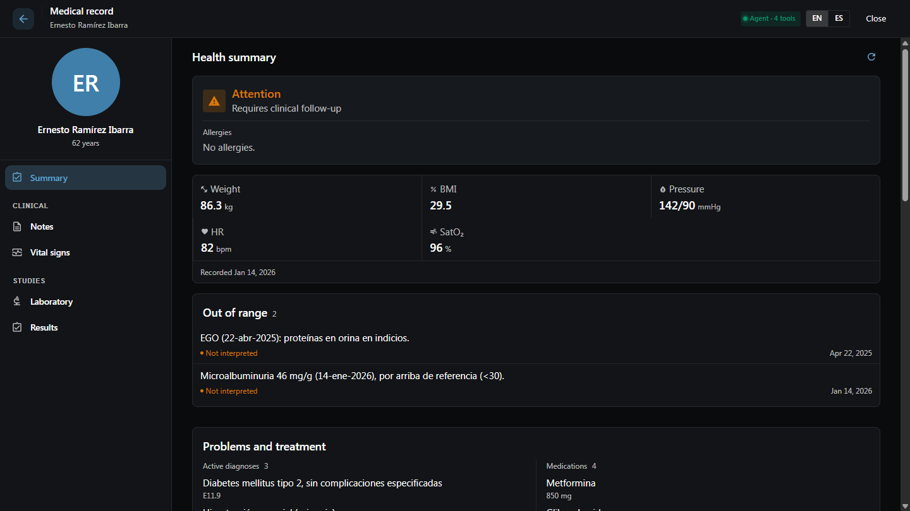
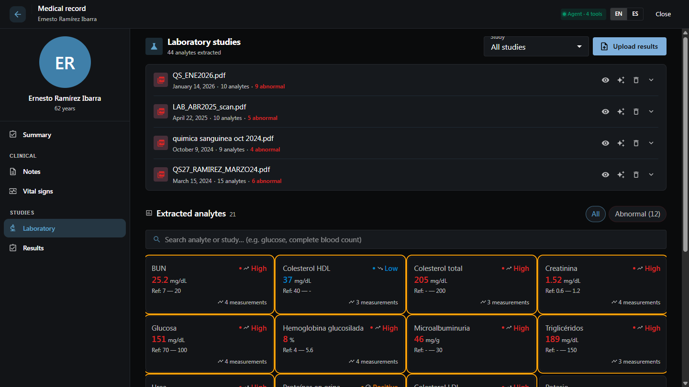
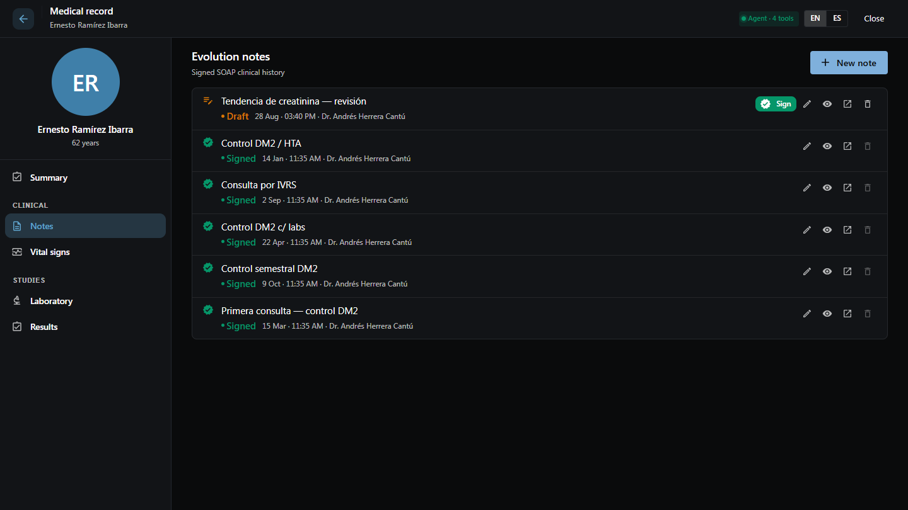

# Healthy Record × WebMCP

**An agent-native electronic health record: the AI agent works inside the physician's already-authenticated session and drives the live chart UI — no credentials ever leave the hospital.**

Built for the [OpenAI WebMCP Challenge](https://webmcp.devpost.com/) by [Healthy Medical AI](https://www.healthyehr.com), a Mexican health-tech startup. This repository is a public, self-contained slice of our production EHR (Healthy Record) with a fully mocked data layer. **Every patient in this demo is synthetic — no real patient data exists anywhere in this repository or its history.**

License: MIT · **Live demo: [healthy-record-webmcp.netlify.app](https://healthy-record-webmcp.netlify.app)** · Demo video: _coming with the submission_

---

## The 60-second story

A type 2 diabetic patient has four routine chemistry panels spread across 22 months of visit notes. Each creatinine value looks almost normal on its own: `0.94 → 1.12 → 1.31 → 1.52 mg/dL`. The **trend** is early kidney disease — and in a 15-minute visit, buried among ten other analytes per study, it is exactly the kind of signal a busy physician plausibly misses. The physician's own notes mention the values in passing and never connect them.

With the chart open, the physician asks their agent:

> *"What changed since the last visit?"*

and the chart moves, step by visible step:

1. `get_chart_summary` returns structured deltas — including which values crossed out of range
2. `plot_lab_trend` **navigates the UI to the Laboratory section and opens the creatinine trend dialog on screen**, reference band included
3. `highlight_findings` makes every out-of-range analyte card **pulse on the physician's screen**
4. `draft_note` writes a SOAP draft anchored to the finding — it lands in the Notes section with a **Sign** button
5. **The physician reviews and signs.** The agent can never sign; writes are proposals by design.

Every tool invocation announces itself with an on-screen "Agent: …" pill first — agent-driven UI movement is always attributable at a glance.

| `get_chart_summary` — the chart the physician opens | `highlight_findings` — out-of-range cards pulse, "Agent:" pill below |
|---|---|
|  |  |

| `draft_note` — the agent's DRAFT lands on top, only the physician can Sign | |
|---|---|
|  | |

## Why this use case is a strong fit for WebMCP

**No hospital hands its EHR credentials to an external agent.** Ever. That single fact rules out the classic integration paths: an external MCP server needs service credentials and an audit story; API integrations need contracts, scopes and a security review per client.

WebMCP dissolves the problem instead of solving it: the agent operates **inside the session the physician already opened**, in the same tab, under the same auth, with the same permissions — and every action is visible on the very screen the physician is looking at. There is no credential handoff because there is no second party.

Two properties of this repo only exist because of WebMCP:

- **Context-scoped tools.** Tools are registered imperatively with one `AbortController` per UI scope: the patient list exposes `list_patients` / `open_patient_chart`; opening a chart aborts those and registers `get_chart_summary` / `plot_lab_trend` / `draft_note` for that patient. Closing the chart unregisters them. The agent's capabilities mirror what the physician can see — which is the correct permission model for a clinical UI, and it is exactly what `registerTool(def, { signal })` + `toolchange` were designed for.
- **Tools that move the interface, not just return data.** `plot_lab_trend` doesn't render a chart in the agent's chat: it drives the product's own trend dialog on the physician's screen. The human and the agent are looking at — and acting on — the same living page.

## How it creates a better user experience

Chart review is the silent tax of every visit: minutes of scrolling through past notes and PDFs, under time pressure, to rebuild context the record already contains. The demo compresses that to one question — and because the answer arrives as **UI the physician already trusts** (their own lab table, their own trend dialog, their own notes section) instead of a wall of chat text, verification is a glance, not a leap of faith.

The safety model is part of the UX: read tools are annotated `readOnlyHint`; the only write tool produces a **DRAFT** that renders with the product's existing DRAFT/SIGNED semantics and requires a human signature. Trust is not a policy document here — it is visible in the interface.

## What people and agents can do together

The physician brings clinical judgment and legal responsibility; the agent brings total recall of the chart. Concretely, in this demo:

- The **agent** finds the buried trend, plots it where the physician can see it, and drafts the note that documents it.
- The **physician** confirms the finding clinically, edits or discards the draft, and signs — turning the agent's recall into a medical record entry that a human vouched for.
- Neither can do the other's half: the agent cannot sign, and the physician cannot re-read 22 months of labs in 15 minutes.

## Try it

Judges can evaluate in either browser:

**Google Chrome (149+)**
1. Enable `chrome://flags/#enable-webmcp-testing` → relaunch
2. Open **https://healthy-record-webmcp.netlify.app** (or `npm install && npm run dev` → http://localhost:5173)
3. Optional: install the official [Model Context Tool Inspector](https://chromewebstore.google.com/detail/model-context-tool-inspec/gbpdfapgefenggkahomfgkhfehlcenpd) to watch registrations and talk to the page in natural language
4. Open **Ernesto Ramírez Ibarra**'s chart — the header chip shows the live toolset ("Agent · 3 tools")

**ChatGPT desktop app** (Work, models GPT-5.6 Sol/Terra): open the live URL in the in-app browser and check **Site tools** in the address bar.

Suggested prompts, in order:

| You say | The agent should |
|---|---|
| *Explain this patient in plain language* | read the chart for you — no medical background needed |
| *What changed since the last visit?* | call `get_chart_summary` → structured deltas |
| *Show me the creatinine trend* | call `plot_lab_trend` → the chart navigates and the trend dialog opens |
| *Draft a note about this finding* | call `draft_note` → a DRAFT appears in Notes with a **Sign** button |
| *Show me his blood pressure trend* | call `plot_vital_trend` → the vitals trend dialog opens |
| *When was kidney function first flagged in the notes?* | call `read_notes` → cites the physician's own April 2025 note |

The UI chrome is in English (toggle to Spanish in the header); the clinical data is deliberately Spanish — messy real-world charting, abbreviations and all, is part of the design.

## The tools

| Tool | Scope | Type | What it does |
|---|---|---|---|
| `list_patients` | Patient list | read | Physician's patients (id, name, age, sex) |
| `open_patient_chart` | Patient list | read | Opens a chart by id or partial name — swaps the toolset |
| `get_chart_summary` | Open chart | read | Structured deltas since the previous visit: labs with prior values, range crossings, vitals, med changes, problems, alerts |
| `read_notes` | Open chart | read | SOAP evolution notes with status and content (`untrustedContentHint`: free-text clinical Spanish) — lets the agent cite what the physician wrote and when |
| `plot_lab_trend` | Open chart | read | Navigates to Labs and opens the analyte trend dialog on screen; returns the series (accepts English or Spanish analyte names) |
| `plot_vital_trend` | Open chart | read | Same, for vital signs: weight, BMI, blood pressure, heart rate, temperature, SpO₂ |
| `highlight_findings` | Open chart | read | Pulses out-of-range analyte cards on screen for ~15 s (all of them, or a given list) |
| `draft_note` | Open chart | **write** | Creates a DRAFT SOAP note the physician must review and **sign in the UI** — the tool cannot sign |

## Architecture notes

- **Real product, mocked transport.** The chart page, its five sections, the trend dialog and the design system are the production Healthy Record frontend (Vite + React 18 + TS + MUI), extracted file-by-file. The data layer (`src/services/ehrService.ts`) reimplements the production API contracts — the same `lab_results` row shape, the same SOAP note states (`DRAFT/SIGNED/AMENDED`), the same trend endpoint semantics — over an in-memory synthetic dataset (`src/mock/db.ts`), so the demo needs no backend and the live URL has nothing to fall over.
- **Progressive enhancement.** Without `document.modelContext` the site behaves identically; the WebMCP layer (`src/webmcp/`) feature-detects and no-ops. With it, a header chip shows the live toolset.
- **Deliberate latency.** The mock layer answers with small realistic delays so agent-driven navigation reads as visible steps, not a repaint.
- **Designed, not generated.** The index patient's dataset is hand-authored so the signal is buried the way it would be in real charting: one almost-normal value per quarterly panel, a scanned PDF, terse notes, fields nobody filled in.

## Data & privacy

All patients are fictitious and hand-written for this demo. The repository was extracted clean-room from the private product codebase: no credentials, no internal endpoints, no real clinical content — verified by scan on every commit. See [LICENSE](LICENSE) (MIT).
